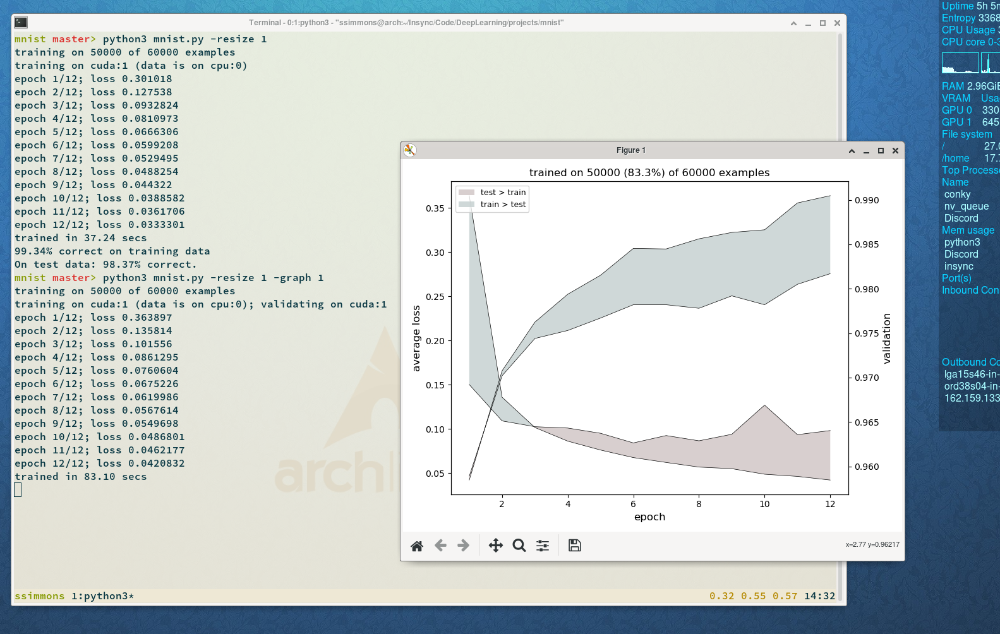

<a id="top"></a>
# Data augmentation

<p align="right"> <a href="https://sj-simmons.github.io/dl">The DL@DU Project</a> </p>

### Contents
* [Prologue](#Prologue)
* [The MNIST data](#the-mnist-data)
  * [Exercise 1](#exercise1_)
* [Primer on Dataset and DataLoader usage](#primer_)
* [Reading data from a folder](#folder_)
* [Online computations](#online_)
* [Data augmentation and transforms](#augmentation_)
  * [Exercise 2](#exercise2_)
* [Training/validating/testing with DataLoaders](#usingdataloaders_)
* [Cross-validating with DataLoaders](#crossvalidating_)
* [Resources](#resources_)


# Prologue

Modern applications of Machine Learning often require training deep networks on
large data sets; hence, usually, we sooner rather than later wish to migrate to
any GPU(s) at our disposal.  But, even modestly sized models and data can lead to
our running out of VRAM.  Specifically, this can happen when we push lots of
large examples from our data through a model that consists of many weights.

When we train on a GPU, we literally *move* our model to the GPU &mdash; meaning that
we move the tensors comprising the model's weights to the VRAM of our GPU.
The gradient information accumulated while feed-forwarding and assembled during
back-propagation will also, then, live in VRAM.

Realize, moreover, that data that we show the model during the training loop must,
too, live on, or have been moved to, the device on which the model resides:
feeding-forwarding data involves, for instance, lots of linear-algebraic operations,
and the entries of both the matrices and vectors need to be on the same computational
device.

In practice, we
* use our CPU to pull our data from our hard-drive into RAM; then,
* we instantiate a model (in RAM using our CPU); then,
* if we have at least one GPU, we move our model to a GPU; then,
* we implement a method for pushing data to that GPU when training the model.

An obvious first attempt at handling the last bullet-point is to simply
move all of our training data to the GPU before the training loop kicks
in. That might work, unless our training data consists of, for instance, many fairly large
images.  Also, we might want to validate our model &mdash; say, once
per epoch &mdash; against a separate dataset.

Naively, we might try moving our model, the training data, and the validation
data to the VRAM of (one of) our GPU(s).  But, remember, we also need room to store
gradients, not mention enough space left over for storage of temporary files
during forward-pass/back-propagation.  Suffice it to say that one can
quickly run out of VRAM.

Now, we already have a partial solution at our disposal: stochastic gradient
descent.  We understand how to leverage the stochasticity inherent in showing
the model mini- instead of full-batches when updating gradients. But notice an
addition benefit: with SGD, we really only need to move, in turn, mini-batches
to VRAM.

Finiteness of VRAM becomes even more of a limitation if we wish to augment our
data. Suppose that we want to train not on just a set of images, but on that set along
with the reflections of those images.  We could write some code to step
through the images, reflect each one, and save it to our hard-drive;  but we've then
doubled the size of our training data (rendering any naive solution less viable).

How should we address the issues above given our tooling?
In this tutorial,
we employ PyTorch's 
[Dataset](https://pytorch.org/docs/stable/data.html#torch.utils.data.Dataset)
and
[DataLoader](https://pytorch.org/docs/stable/data.html?highlight=dataloader#torch.utils.data.DataLoader)
classes and develop machinery to augments even large data sets in such a way that we
can still efficiently train models.  More concretely,
we probabilistically enhance features of our training data via various
[transforms](https://pytorch.org/docs/stable/torchvision/transforms.html) and then
push augmented mini-batches to VRAM for training.

# The MNIST data

Before we get into the meat of this tutorial, let us turn loose our convolutional models
from the previous project on the well-known [MNIST](http://yann.lecun.com/exdb/mnist/) 
hand-written digit dataset. A convenient way to get our hands on the MNIST data, and other
standard datasets, is to use PyTorch's
[torchvision.datasets](https://pytorch.org/docs/stable/torchvision/datasets.html#torchvision-datasets)
class.
```python
import torch
from torchvision import datasets

dataset = datasets.MNIST('~/data', download=True)
```
The code block above retrieves the MNIST data, creates a directory
called `data` just off your home directory, and  writes the
data to that directory.

Notes
* **datasets.MNIST** is an instance of the
  [Dataset](https://pytorch.org/docs/stable/data.html#torch.utils.data.Dataset)
  class (discussed below).
* **datasets.MNIST** only bothers to download the image data if it doesn't
  find it already in the specified directory .

Below we will use the Dataset class in conjunction with the
[DataLoader](https://pytorch.org/docs/stable/data.html?highlight=dataloader#torch.utils.data.DataLoader)
class.  Using DataLoader for small data sets is overkill; but in the presence
of large amounts of data or situations where we wish to transform some or all of
the training data, DataLoader (often alongside Dataset) can save the day.

We'll employ the full power of DataLoader later.  For now, let us pull out, in
the form of tensors, the MNIST images from the instance **dataset** that we
created above. Then, we should be able to cut loose our code from the previous
project.

``` python
features = dataset.data
isinstance(features, torch.Tensor)  # true
features.type()  # 'torch.ByteTensor'
features = features.to(dtype=torch.float32)
features.type()  # 'torch.FloatTensor'
```
We see above that **features** is a byte tensor. So we converted it to
a **FloatTensor**.

The MNIST data consists of 60K black and white images, each of size 28x28.
``` python
features.shape  # torch.Size([60000, 28, 28])
```
For a sanity check, let us look at the 150th one:
```
xs = features[149]
xs.shape  # torch.Size([28, 28])
for x in xs[4:26]:
    print(''.join(map(lambda x: str(int(x)).rjust(3), x.tolist()[3:22])))

0  0  0  0  0  0  0  0  0  0  0  0  0  0  0  0  0  0  0
0  0  0  0  0  0101144253253255253253253253255128 25  0
0  0  0 57163226249252252252253252252252252253252103  0
0 19166234252253252252214195196 70133 71227253252195  0
0 76246252252225 99 84 28  0  0  0  0  0140253252195  0
0  0 88112112  0  0  0  0  0  0  0  0 95203253252195  0
0  0  0  0  0  0  0  0  0  0  0  0120253253255215 31  0
0  0  0  0  0  0  0  0  0  0 38210246252252215 33  0  0
0  0  0  0  0  0  0  0  0 32222252252252173 31  0  0  0
0  0  0  0  0  0 26 60169215253252252252252169 34  0  0
0  0  0  0  0 63240252252252253252252252252253214 31  0
0  0  0  0  0255253253253190141 94  0  0141255253 56  0
0  0  0  0  0 90167167 74 12  0  0  0  0 94253252180  0
0  0  0  0  0  0  0  0  0  0  0  0  0  0  0253252195  0
0  0  0  0  0  0  0  0  0  0  0  0  0  0  0253252195  0
0  0  0  0  0  0  0  0  0  0  0  0  0  0 79253252195  0
0  0  0  0  0  0  0  0  0  0  0  0  0  0141255253196  0
0  0  0  0 48 85  9  0  0  0  0  0 67178240253223 52  0
0  0  0  0140253203165 57135198197240252252228 52  0  0
0  0  0  0 47237252252252252253252252249145 47  0  0  0
0  0  0  0  0 50237252252252253252220 99  0  0  0  0  0
0  0  0  0  0  0  0  0  0  0  0  0  0  0  0  0  0  0  0
```

Next, let us get the targets (these are also byte tensors, so we
convert to type **LongTensor**).
``` python
targets = dataset.targets.to(dtype=torch.long)
targets.type()  # 'torch.LongTensor'
```
<a id="exercise1_"></a>
No surprises here:
``` python
targets[149]  # tensor(3)
```

#### Exercise

1. Now that you have the features and targets of all 60K MNIST digits,
   implement a classifier (along the lines of your solution to the
   previous project). Be sure to gauge performance on unseen test data.
   * How well does your trained model perform?
   * What are the specifics of the CNN that you built?

   <a id="exercise1codeblock"></a>
   For convenience, here is the essential code from above:
   ``` python
   import torch
   from torchvision import datasets

   dataset = datasets.MNIST('~/data', download=True)
   features = dataset.data.to(dtype=torch.float32)
   targets = dataset.targets.to(dtype=torch.long)
   ```

<a id="primer_"></a>
####

# Primer on Dataset and DataLoader usage

Recall from above that
[torchvision.datasets](https://pytorch.org/docs/stable/torchvision/datasets.html#torchvision-datasets)
provides easy access to the MNIST data.  Referring to the following code block,
notice that the MNIST data is evidently packaged up (in its instance of
[Dataset](https://pytorch.org/docs/stable/data.html#torch.utils.data.Dataset)
) in
such a way that it yields pairs of
type **(PIL.Image.Image, int)**.
``` python
import torch
from torchvision import datasets

dataset = datasets.MNIST('~/data', download=True)  # dataset is now an instance of torch.utils.data.Dataset
print(dataset[0])  # (<PIL.Image.Image image mode=L size=28x28 at 0x7751C99C88>, 5)
```

The [Dataset](https://pytorch.org/docs/stable/data.html#torch.utils.data.Dataset)
class is simple and  straightforward; here is its
[definition](https://pytorch.org/docs/stable/_modules/torch/utils/data/dataset.html#Dataset).
A subclass of Dataset must implement the **__getitem__** method;  usually, one also
implements a **__len__** method.

Suppose that we want to create an instance of Dataset that yields a pair
consisting of a 28x28 input tensor (instead of a PIL image) and its corresponding
output (long) tensor.  To do this, we could extend or otherwise incorporate
**datasets.MNIST**.  For instructional purposes let us instead simply subclass
Dataset from scratch, passing it the **features** and **targets** we extracted above:

``` python
import torch
from torchvision import datasets
from torch.utils.data import Dataset, DataLoader

class MNISTDataset(Dataset):
    def __init__(self, features, targets):
        assert len(features) == len(targets)
        self.features = features
        self.targets = targets

    def __len__(self):
        return len(self.features)

    def __getitem__(self, idx):
        return self.features[idx], self.targets[idx]

dataset = datasets.MNIST('~/data', download=True)
features = dataset.data.to(dtype=torch.float32)
targets = dataset.targets.to(dtype=torch.long)

mnistdataset = MNISTDataset(features, targets)
```
Then we have:
``` python
type(mnistdataset[0])  # <class 'tuple'>
len(mnistdataset[0])  # 2
len(mnistdataset)  # 60000
mnistdataset[0][0].shape  # torch.Size([28, 28])
mnistdataset[0][1]  # tensor(5)
```
Let us now extend and instance the
[DataLoader](https://pytorch.org/docs/stable/data.html?highlight=dataloader#torch.utils.data.DataLoader)
class. Then we will combine
that instance with our instance **mnistdataset** of Dataset in order to train a digit
classification model on MNIST data. (Yes, you already  have such a trained
model &mdash; from your solution to [exercise 1](#exercise1_) &mdash; but now
we want to use DataLoader.)
``` python
loader = DataLoader(dataset=mnistdataset, batch_size=20, num_workers=4, shuffle=True)
```
Have a look at the
[documentation](https://pytorch.org/docs/stable/data.html?highlight=dataloader#torch.utils.data.DataLoader)
for the DataLoader class. The parameter **num_workers** sets the number
of subprocesses that work on kicking out batches. The optimal number of
workers depends on your hardware, your data, and your code. Suppose that your
hardware and code are such that training takes place on a GPU, then the idea is
to set **num_workers** just high enough so that whenever the GPU finishes processing a
given mini-batch, the instance **loader**, running on the CPU, has provided the next
mini-batch.

We have:
``` python
for mini_batch in loader:
    print(type(mini_batch)) # <class 'list'>
    list(map(lambda x: print(type(x), x.shape), mini_batch))
    # <class 'torch.Tensor'> torch.Size([20, 28, 28])
    # <class 'torch.Tensor'> torch.Size([20])
    break
```
Here **loader** is acting as a generator that yields **mini_batch**es which it
collects from **mnistdataset**.  Due to the way we constructed **MNISTdataset**,
each **mini_batch** is a list of length 2; the first entry is a
20x28x28 tensor consisting of 20 features and the second entry is a tensor
holding the corresponding 20 targets.

Let's put this all together and write a program that trains a model on MNIST
data.  For convenience, we use a few constructs from [DUlib](https://sj-simmons.github.io/dl/setup/dulib).
``` python
# program1.py
import torch
import torch.nn as nn
from torchvision import datasets
from torch.utils.data import Dataset, DataLoader
import du.lib as dulib
import du.utils
from du.conv.models import ConvFFNet

# process command-line arguments
parser = du.utils.standard_args(
    desc='Train and test a model on MNIST data', lr=0.001, mo=0.92, bs=20,
    epochs=12, props=(5/6,), channels=(1,16), widths=(10,))
parser.add_argument('-resize',help='step on the data',type=float,default=.1)
args = parser.parse_args()

# get the mnist data
mnist_data = datasets.MNIST('~/data', download=True)
features = mnist_data.data.to(dtype=torch.float32)
targets = mnist_data.targets.to(dtype=torch.long)

# randomly select a subset of the data
if args.resize < 1:
    features, _, targets, _ = dulib.coh_split(args.resize, features, targets)

# it's standard practice to train on first 50K digits and test on last 10K
if args.props[0] == 5/6:
    train_feats, test_feats, train_targs, test_targs =\
        dulib.coh_split(5/6, features, targets, randomize=False)
else:
    train_feats, test_feats, train_targs, test_targs =\
        dulib.coh_split(args.props, features, targets)

# center and normalize training data
train_feats, train_means = dulib.center(train_feats)
train_feats, train_stdevs = dulib.normalize(train_feats)

# if test_data, center/normalize those w/r to means/stdevs of train data
if args.props[0] < 1:
    test_feats, _ = dulib.center(test_feats, train_means)
    test_feats, _ = dulib.normalize(test_feats, train_stdevs)

print(f'training on {len(train_feats)} of {len(features)} examples')

# create a subclass of Dataset for holding the training data
class TrainingDataset(Dataset):
    def __init__(self, features, targets):
        assert len(features) == len(targets)
        self.features = features
        self.targets = targets

    def __len__(self):
        return len(self.features)

    def __getitem__(self, idx):
        return self.features[idx], self.targets[idx]

# an instance of Dataset holding the training data
train_dataset = TrainingDataset(train_feats, train_targs)

# create an instance of loader that kicks out mini-batches
train_loader = DataLoader(
    dataset = train_dataset,
    batch_size = args.bs,
    num_workers = 0,
    shuffle = True)

# a convolutional model to train
model = ConvFFNet(
    in_size = (28, 28),
    n_out = 10,
    channels = args.channels,
    widths = args.widths)

criterion = nn.NLLLoss()

# train the model
z_parameters = []
for param in model.parameters():
    z_parameters.append(param.data.clone())
for param in z_parameters:
    param.zero_()

for epoch in range(args.epochs):
    accum_loss = 0
    for mini_batch in train_loader:

        # forward pass
        predicted_targs = model(mini_batch[0])
        actual_targs = mini_batch[1]
        loss = criterion(predicted_targs, actual_targs)
        accum_loss += loss.item()

        # back propagation
        model.zero_grad()
        loss.backward()

        # adjust the weights
        for z_param, param in zip(z_parameters, model.parameters()):
            z_param = args.mo * z_param + param.grad.data
            param.data.sub_(z_param * args.lr)
    print(f'epoch: {epoch+1}, loss: {accum_loss*args.bs/len(train_feats)}')

training_accuracy = 100*dulib.class_accuracy(model,(train_feats,train_targs))
print(f'Accuracy: {training_accuracy:.2f}% correct on training data;', end=' ')

if args.props[0] < 1:
    test_accuracy = 100*dulib.class_accuracy(model,(test_feats,test_targs))
    print(f'on test data, {test_accuracy:.2f}% correct.')
```
With the default values for the switches (run the code above with the **-h** switch
to see other options) the output is:
```shell
training on 5000 of 6000 examples
epoch: 1, loss: 1.1695459526777268
epoch: 2, loss: 0.41565694713592527
epoch: 3, loss: 0.2933421110659838
epoch: 4, loss: 0.22951760046184064
epoch: 5, loss: 0.1860628728866577
epoch: 6, loss: 0.1538740832991898
epoch: 7, loss: 0.13374821071885526
epoch: 8, loss: 0.11240356637910008
epoch: 9, loss: 0.09491550475172698
epoch: 10, loss: 0.08287064430117608
epoch: 11, loss: 0.06956178618129343
epoch: 12, loss: 0.058856538637541235
99.08% correct on training data
On test data: 95.70% correct.
```
By default, the program trains and tests on only 10% of the MNIST data (run it with
the switch **-resize 1.0** to use all of the data).
Here is the model that is being trained:
``` python
ConvFFNet(
  (conv): Sequential(
    (0): Sequential(
      (0): Conv2d(1, 16, kernel_size=(5, 5), stride=(1, 1), padding=(2, 2))
      (1): ReLU()
      (2): MaxPool2d(kernel_size=2, stride=2, padding=0, dilation=1, ceil_mode=False)
    )
  )
  (dense): Sequential(
    (0): Linear(in_features=3136, out_features=10, bias=True)
    (act0): ReLU()
    (lin1): Linear(in_features=10, out_features=10, bias=True)
  )
)
```
As we noted above, on manageable datasets there is no need to use the **DataLoader** class.
But on data sets that say do not fit in VRAM, **DataLoader** provides a concise and
powerful solution.

The program below is similar to the one above.  The difference is that it uses
DUlib's **train** function which
* accepts training data in the form of an instance of DataLoader, and
* seamlessly trains in the most efficient way in the presence of a GPU.

``` python
# mnist.py
import torch
import torch.nn as nn
from torchvision import datasets
from torch.utils.data import Dataset, DataLoader
import du.lib as dulib
import du.utils
from du.conv.models import ConvFFNet

# process command-line arguments
parser = du.utils.standard_args(
    desc='Train and test a model on MNIST data.', lr=0.001, mo=0.92, bs=20,
    epochs=12, gpu=(-1,), props=(5/6,), channels=(1,16), widths=(10,), graph=0)
parser.add_argument('-resize',help='step on the data',type=float,default=.1)
args = parser.parse_args()

# get the mnist data
mnist_data = datasets.MNIST('~/data', download=True)
features = mnist_data.data.to(dtype=torch.float32)
targets = mnist_data.targets.to(dtype=torch.long)

# use only a (randomly chosen) percentage of the data
if args.resize < 1:
    features, _ , targets, _ = dulib.coh_split(args.resize, features, targets)

# it's standard practice to train on first 50K digits and test on last 10K
if args.props[0] == 5/6:
    train_feats, test_feats, train_targs, test_targs =\
        dulib.coh_split(5/6, features, targets, randomize=False)
else:
  train_feats, test_feats, train_targs, test_targs =\
      dulib.coh_split(args.props[0], features, targets)

# center and normalize training data
train_feats, train_means = dulib.center(train_feats)
train_feats, train_stdevs = dulib.normalize(train_feats)

# if test_data, center/normalize those w/r to means/stdevs of train data
if args.props[0] < 1:
    test_feats, _ = dulib.center(test_feats, train_means)
    test_feats, _ = dulib.normalize(test_feats, train_stdevs)

print(f'training on {len(train_feats)} of {len(features)} examples')

# create a subclass of Dataset for holding the training data
class TrainingDataset(Dataset):
    def __init__(self, features, targets):
        assert len(features) == len(targets)
        self.features = features
        self.targets = targets

    def __len__(self):
        return len(self.features)

    def __getitem__(self, idx):
        return self.features[idx], self.targets[idx]

# an instance of Dataset holding the training data
train_dataset = TrainingDataset(train_feats, train_targs)

# create an instance of loader that kicks out mini-batches
train_loader = DataLoader(
    dataset = train_dataset,
    batch_size = args.bs,
    num_workers = 0,
    shuffle = True)

# a convolutional model to train
model = ConvFFNet(
    in_size = (28, 28),
    n_out = 10,
    channels = args.channels,
    widths = args.widths)

# train the model
model = dulib.train(
    model = model,
    crit = nn.NLLLoss(),
    train_data = train_loader,
    valid_data = (test_feats, test_targs) if args.props[0] < 1 else None,
    args = args)

training_accuracy = 100*dulib.class_accuracy(model,(train_feats,train_targs))
print(f'Accuracy: on training data, {training_accuracy:.2f}% correct;', end=' ')

if args.props[0] < 1:
    test_accuracy = 100*dulib.class_accuracy(model,(test_feats,test_targs))
    print(f'on test data, {test_accuracy:.2f}% correct.')
```
Below is a screenshot of two runs &mdash; on all of the MNIST data &mdash; of
the program above on the ArchLinux machine in Simmons' office.  Both runs use
the CPU to kick out batches (via an instance of **DataLoader**), and both
train the model on the GPU.  The first run is twice as fast as the second.
That's because, without graphing, DUlib's train function doesn't bother to
compute the loss on testing data during training.

<p align="center">
  
</p>

<a id="folder_"></a>
####

# Reading images from a folder

Let us return to the data in the previous project.  Recall that the digits in that
project came to us in the form of one (large) **png** file.  A more common situation
is that our images are separate files, all in one directory, along with a **csv**
file that describes  the images.

Change into the **~/data** directory that we created above and create a subdirectory
called **20by20digits** by issuing the following at your command prompt:

```shell
cd ~/data; mkdir 20by20digits
```

Then, in a directory that contains the file
[digits.png](digits.png)
from the previous project, run the following program at the command line.
``` python
# make20by20.py
from PIL import Image
import csv
from pathlib import Path

digits = Image.open('digits.png') # 2000 x 1000
imagedir = str(Path.home()/'data/20by20digits')+'/'

# put the 20x20 sub-images in the specified directory
idx = 0
for i in range(0, 1000, 20):
    for j in range(0, 2000, 20):
        digit = digits.crop((j, i, j+20, i+20))
        digit.save(imagedir+'image'+str(idx).zfill(4)+'.png')
        idx += 1

# write the csv file
with open(imagedir+'images.csv','w') as csv_file:
    writer = csv.DictWriter(csv_file, fieldnames = ['filename', 'label'])
    writer.writeheader()
    for i in range(5000):
        writer.writerow({'filename' : 'image'+str(i).zfill(4), 'label': i//500})
```
The **data** subdirectory that resides just off your home directory should
now  hold two subdirectories, **MNIST** (from before) and, now, **20by20digits**.
And the subdirectory **20by20digits** should contain 5000 images and one **csv**
file. (You might want to **cd** into **20by20digits** and make sure the images
are there.)

Note that, since the images in the original file
[digits.png](https://github.com/sj-simmons/deep-learning/blob/master/projects/convolutional-net/images/digits.png)
are already in order, our csv file has some redundancy. Often, in practice, the filenames
alone do not contain all relevant information regarding features.

Now suppose that we *only* have the directory of images (including the csv file) that we just created. What
is the most sensible way to read those images, and extract corresponding target(s),
into mini-batches of tensors?

A nice solution, particularly for large amounts of data, is to use an instance of Dataset in
conjunction with an instance of DataLoader.

First we instance Dataset as follows.
``` python
from skimage import io
import pandas as pd
import pathlib, torch
from torch.utils.data import Dataset, DataLoader
import torchvision.transforms

imagedir = str(pathlib.Path.home()/'data/20by20digits')+'/'
csvfile = 'images.csv'

class ImageData(Dataset):
    def __init__(self, imagedir, csvfile, *transforms):
        assert len(transforms) == 2
        self.frame = pd.read_csv(imagedir+csvfile)
        self.dir = imagedir
        self.transforms = transforms

    def __len__(self):
        return(len(self.frame))

    def __getitem__(self, idx):
        imagefile = self.dir + self.frame.iloc[idx, 0] + '.png'
        imagelabel = self.frame.iloc[idx, 1]
        return self.transforms[0](io.imread(imagefile)), self.transforms[1](imagelabel)

feat_transform = torchvision.transforms.Compose([
    torchvision.transforms.ToTensor(),
    torchvision.transforms.Lambda(lambda xs: xs.squeeze(0))])
targ_transform = torchvision.transforms.Lambda(lambda xs: torch.tensor(xs))

dataset = ImageData(imagedir, csvfile, feat_transform, targ_transform)
```
We can check a few things to see if this is working:
``` python
len(dataset)  # 5000
dataset[1500][0].size()  # torch.Size([20, 20])
dataset[1500][1]  # tensor(3)
```
If we now instance DataLoader:
``` python
loader = DataLoader(dataset = dataset, batch_size=16, num_workers=2, shuffle=True)
```
we can:
``` python
for minibatch in loader:
    print(minibatch[0].size())  # torch.Size([16, 20, 20])
    print(minibatch[1])  # tensor([0, 5, 0, 6, 2, 1, 0, 2, 8, 2, 3, 7, 2, 3, 0, 6])
    break
```
Before moving on, let us modify our **ImageData** class above so
as to render it more useful in practice:
```python
from skimage import io
import pandas as pd
import pathlib, torch
from torch.utils.data import Dataset, DataLoader
import torchvision.transforms

imagedir = str(pathlib.Path.home()/'data/20by20digits')+'/'
csvfile = 'images.csv'

class ImageData(Dataset):
    def __init__(self, imagedir, csvfile, *transforms):
        self.frame = pd.read_csv(imagedir+csvfile)
        self.dir = imagedir
        self.transforms = transforms

    def __len__(self):
        return(len(self.frame))

    def __getitem__(self, idx):
        imagefile = self.dir + self.frame.iloc[idx, 0] + '.png'
        imagelabel = self.frame.iloc[idx, 1]
        return tuple(
            tform(xs) for tform, xs in zip(self.transforms,
                                           (io.imread(imagefile), imagelabel)
                                       ) if tform is not None)

feat_transform = torchvision.transforms.Compose([
    torchvision.transforms.ToTensor(),
    torchvision.transforms.Lambda(lambda xs: xs.squeeze(0))])
targ_transform = torchvision.transforms.Lambda(lambda xs: torch.tensor(xs))
```
We obtain the same functionality as above:
``` python
dataset = ImageData(imagedir, csvfile, feat_transform, targ_transform)

len(dataset)  # 5000
len(dataset[1500])  # 2
dataset[1500][0].size()  # torch.Size([20, 20])
dataset[1500][1]  # tensor(3)
```
but, if we wish, we can use the same class to index only the features:
``` python
dataset = ImageData(imagedir, csvfile, feat_transform)

len(dataset)  # 5000
len(dataset[1500])  # 1
dataset[1500][0].size()  # torch.Size([20, 20])
```
or, only the targets:
``` python
dataset = ImageData(imagedir, csvfile, None, targ_transform)

len(dataset)  # 5000
len(dataset[1500])  # 1
dataset[1500][0].size()  # torch.Size([])
```

<a id="online_"></a>
####

# Online computations

Now let us suppose that our individual images are huge and/or that we have very
many of them. Imagine a data set so large that we cannot load it (all at once)
into RAM, much less VRAM, without causing problems.

The good news is that the instance **dataset** that we created above works alongside
an instance of DataLoader to pull in data, kick out mini-batches, garbage
collect, pull in more data, and so on.  So thanks to PyTorch, we don't have to
free up memory manually in the presence of a large data set (or data streams).

But what if we want to center and normalize our training
data? If we can't read all the data at once into memory, then how can we compute
the means and standard deviations of all the training features? And, supposing that we somehow have the means and standard deviations,
how can we *standardize* (i.e., center and normalize) the training data?

<a id="onlineprog_"></a>
Continuing with our 20x20-images example code above (but imagining that we have
many such images), we can implement *online* computation of means and
standard deviations and, in fact, online training as follows.

```python
# program2.py
from skimage import io
import pandas as pd
import pathlib, torch
import torch.nn as nn
from torch.utils.data import Dataset, DataLoader
import torchvision.transforms
import du.lib as dulib
import du.utils, du.conv.models

# set up command-line switches
parser = du.utils.standard_args(
    'Convolutional model.', epochs=20, lr=0.01, mo=0.94, bs=32, props=(0.8,),
    channels=(1,24), widths = (10,), gpu=(-1,), graph=0, verb=3, cm=False)
args = parser.parse_args()

# get all of the image data in the form of a pandas dataframe
imagedir = str(pathlib.Path.home()/'data/20by20digits')+'/'
csvfile = 'images.csv'
df = pd.read_csv(imagedir+csvfile)

# split out training and testing dataframes
train_df = df.sample(frac = args.props[0])
test_df = df.drop(train_df.index)

# subclass Dataset appropriately for the training data
class TrainData(Dataset):
    def __init__(self, imagedir, dataframe, *transforms):
        self.frame = dataframe
        self.dir = imagedir
        self.transforms = transforms

    def __len__(self):
        return len(self.frame)

    def __getitem__(self, idx):
        imagefile = self.dir + self.frame.iloc[idx, 0] + '.png'
        imagelabel = self.frame.iloc[idx, 1]
        return tuple(
            tform(xs) for tform, xs in zip(self.transforms,
                                           (io.imread(imagefile), imagelabel)
                                       ) if tform is not None)

# this will be used to compute the means and stdevs of training data features
feat_transform = torchvision.transforms.Compose([
    torchvision.transforms.ToTensor(),
    torchvision.transforms.Lambda(lambda xs: xs.squeeze(0))])

# (online) compute the means and stdevs
traindata = TrainData(imagedir, train_df, feat_transform)
trainloader = DataLoader(dataset=traindata, batch_size=100)
(feats_means, feats_stdevs), = dulib.online_means_stdevs(trainloader)

# add standardization to features transform and create a transform for targets
feat_transform = torchvision.transforms.Compose([
    feat_transform,
    torchvision.transforms.Lambda(
        lambda xs: dulib.standardize(xs,means=feats_means,stdevs=feats_stdevs))])
targ_transform = torchvision.transforms.Lambda(lambda xs: torch.tensor(xs))

# re-instance TrainData using targs_transform so we output (feature, target) pairs
traindata = TrainData(imagedir, train_df, feat_transform, targ_transform)

# re-instance DataLoader for training
trainloader = DataLoader(
    dataset=traindata, batch_size=args.bs, num_workers=2, shuffle=True)

# extract the test data (which is typically of manageable size) as tensors
test_feats = torch.stack([
    feat_transform(
        io.imread(imagedir+filename+'.png')
    ) for filename in test_df['filename']],
    0)
test_targs = torch.stack([
    targ_transform(label) for label in test_df['label'].values])

# create a convolutional model
model =  du.conv.models.ConvFFNet(
    in_size = (20, 20),
    n_out = 10,
    channels = args.channels,
    widths = args.widths)

# train the model
model = dulib.train(
    model = model,
    crit = nn.NLLLoss(),
    train_data = trainloader,
    valid_data = (test_feats, test_targs) if args.props[0] < 1 else None,
    args = args)

training_accuracy = 100*dulib.class_accuracy(model,trainloader)
print(f'On training data, {training_accuracy:.2f}% correct;', end=' ')

if args.props[0] < 1:
    test_accuracy = 100*dulib.class_accuracy(model,(test_feats,test_targs))
    print(f'on test data, {test_accuracy:.2f}% correct.')
```

The program above  uses tools we have developed to train a digit
classification model on the 20x20 hand-drawn digits data set. Remember that
it works even for data sets too large to fit in memory. The online
computation of means and standard deviations is carried out by a function
in DUlib called **du.lib.online_means_stdevs**, the source code of which
lives in [du.lib](https://github.com/sj-simmons/DUlib/blob/master/du/lib.py).

<a id="augmentation_"></a>
####

# Data augmentation and transforms

Imagine that someone is writing numbers on a window, and that we want to
train a model that recognizes digits from either the front *or the backside*
of the glass. (Let us still assume that we have processed the digits so that
we have white digits on a black background.)

This is the same problem as above except that we want to recognize digits that
appear reflected (from left to right).  For example, we want to be able to
classify the following as a 3:
```
  0  0  0  0  0  0  0  0  0  0  0  0  0  0  0  0  0  0  0
  0  0 25128255253253253253255253253144101  0  0  0  0  0
  0  0103252253252252252252253252252252249226163 57  0  0
  0  0195252253227 71133 70196195214252252253252234166 19
  0  0195252253140  0  0  0  0  0 28 84 99225252252246 76
  0  0195252253203 95  0  0  0  0  0  0  0  0112112 88  0
  0  0 31215255253253120  0  0  0  0  0  0  0  0  0  0  0
  0  0  0 33215252252246210 38  0  0  0  0  0  0  0  0  0
  0  0  0  0 31173252252252222 32  0  0  0  0  0  0  0  0
  0  0  0 34169252252252252253215169 60 26  0  0  0  0  0
  0  0 31214253252252252252253252252252240 63  0  0  0  0
  0  0 56253255141  0  0 94141190253253253255  0  0  0  0
  0  0180252253 94  0  0  0  0 12 74167167 90  0  0  0  0
  0  0195252253  0  0  0  0  0  0  0  0  0  0  0  0  0  0
  0  0195252253  0  0  0  0  0  0  0  0  0  0  0  0  0  0
  0  0195252253 79  0  0  0  0  0  0  0  0  0  0  0  0  0
  0  0196253255141  0  0  0  0  0  0  0  0  0  0  0  0  0
  0  0 52223253240178 67  0  0  0  0  0  9 85 48  0  0  0
  0  0  0 52228252252240197198135 57165203253140  0  0  0
  0  0  0  0 47145249252252253252252252252237 47  0  0  0
  0  0  0  0  0  0 99220252253252252252237 50  0  0  0  0
  0  0  0  0  0  0  0  0  0  0  0  0  0  0  0  0  0  0  0
```
<a id="exercise2_"></a>
Can train a model do this using only MNIST data?

#### Exercise

2. Use the ideas and data in this tutorial to train *and test* a model
   that classifies both hand-drawn digits and horizontally reversed
   hand-drawn digits. Feel free to use the 20x20 images, if you wish,
   since they are smaller, though you might be better rewarded for your
   effort if you train on MNIST data.
   * Hint: there are a couple of approaches to organizing a solution
     to this exercise, but have a look at Pytorch's
     [torchvision.transforms](https://pytorch.org/docs/stable/torchvision/transforms.html).
   * Can you extend the ideas used in the [program](#onlineprog_)
     above to solve this problem?
   * Were you able to achieve accuracy on test data in the mid to high 90s?
     Did you tweak your learning parameters?  Did you modify your model architecture?

<a id="usingdataloaders_"></a>
####

# Training/validating/testing with DataLoaders

Above, we handled the issue of possibly massive *training* data by using an instance of
**torch.utils.data.Dataset** to read in data as needed when kicking out mini-batches
during training. Often, our data consists so many large examples that even our *test*
and *validation* sets will not fit in VRAM &mdash; for instance, validating  while training
can be a problem.

We now rewrite our last program above in such a way that each of the training,
validation, and test sets can be larger than GPU (or even CPU) memory allows.

In **program3.py** (below) we use a variation of the custom subclass of
**Dataset** that we constructed above:
```
class Data(torch.utils.data.Dataset):
    """Base class for data sets.

    """
    def __init__(self, df, maps, *transforms):
        assert len(transforms) <= len(maps)
        self.df = df
        self.mps = maps
        self.tfs = transforms

    def __len__(self):
        return len(self.df)

    def __getitem__(self, idx):
        return tuple(tf(mp(self.df,idx)) for tf, mp in zip(self.tfs, self.mps) if tf is not None)
```
The class **Data** is similar to the class **TrainData** in **program2.py** (above), except for the 
parameter **maps**.

In a previous section, we created cvs file  called **images.csv** that indexes the 20x20 images; it lives
in the directory **~/data/20by20digits/** and starts like this:
``` shell
filename   label
image0000  0
image0001  0
image0002  0
image0003  0
image0004  0
image0005  0
image0006  0
image0007  0
image0008  0
image0009  0
image0010  0
image0011  0
```

After reading the csv file into a instance of Pandas' Dataframe class, we need to
encode how to get images and labels into an instance of the `Data` class. Notice
that the lambda functions in the tuple **maps** define precisely those encodings.
``` python
directory = str(pathlib.Path.home()/'data/20by20digits')+'/'
df = pandas.read_csv(directory+'images.csv')

maps = (
    lambda df, idx: io.imread(imagedir+df.iloc[idx, 0]+'.png'), # returns a PIL image
    lambda df, idx: df.iloc[idx, 1]  # returns an int
)
```
Have a look at **program3.py** as an example of using **maps** in conjunction with the
**Data** class.

Notes
* We use the 20x20 images &mdash; again, only for demonstration purposes as those
  data are small.
* We assume the existence of a directory **20by20digits** which resides in **~/data/**
  and which holds the images as **png** files along with an indexing **.csv** file.
  (See above for how to generate such a  directory.)
* If you run the program below with the command-line switch **-verb 0**, then
  the output is suitable for logging:
  ``` shell
  python3 program3.py -v 0 >> logfile
  ```

```python
# program3.py
import datetime
from skimage import io
import pandas as pd
import pathlib, torch
import torch.nn as nn
from torch.utils.data import Dataset, DataLoader
import torchvision.transforms as t
import du.lib as dulib
import du.utils, du.conv.models

# set up command-line switches
parser = du.utils.standard_args(
    'Convolutional model for 20x20 digits.', epochs=20, lr=0.01, mo=0.94, bs=32,
    props=(0.7,0.15,0.15), channels=(1,24), widths = (10,), gpu=(-1,), graph=0, verb=3,
    cm=False)
parser.add_argument('-colorize',help='toggle colorizing',action='store_false')
args = parser.parse_args()

# log info on selected learning hyper-parameters, etc.
logstring = du.utils.args2string(
    args, ['epochs','bs','lr','mo','gpu'],
    timestamp = True if args.verb < 1 else False, color=args.colorize) + '\n'

start = datetime.datetime.now()

# get all of the image data in the form of a pandas dataframe
imagedir = str(pathlib.Path.home()/'data/20by20digits')+'/'
csvfile = 'images.csv'
df = pd.read_csv(imagedir+csvfile)

# how to extract the data from df when creating datasets for dataloaders
maps = (lambda df, idx: io.imread(imagedir+df.iloc[idx, 0]+'.png'), # returns a PIL image
        lambda df, idx: df.iloc[idx, 1])  # returns an int

# split out training, validation, and testing dataframes
if len(args.props) == 1:
    train_df = dulib.split_df(df, args.props)
    logstring += f'Training {len(train_df)} examples\n'
else:
    train_df, valid_df, test_df = dulib.split_df(df, args.props)
    logstring += ('Training/validating/testing on '
                  f'{len(train_df)}/{len(valid_df)}/{len(test_df)} examples\n')

# we first use this to compute the means and stdevs of training data features
feat_transform= t.Compose([t.ToTensor(), t.Lambda(lambda xs: xs.squeeze(0))])

# (online) compute the means and stdevs of the training data
traindata = dulib.Data(train_df, maps, feat_transform)
trainloader = DataLoader(dataset=traindata, batch_size=100)
(feats_means, feats_stdevs), = dulib.online_means_stdevs(trainloader)

# add standardization to the features transform and re-instance traindata using
# targs_transform so we output (feature, target) pairs
feat_transform = t.Compose([
    feat_transform,
    t.Lambda(lambda xs: dulib.standardize(xs, means=feats_means, stdevs=feats_stdevs))])
targ_transform = t.Lambda(lambda xs: torch.tensor(xs))
traindata = dulib.Data(train_df, maps, feat_transform, targ_transform)
# we must also re-instance trainloader
trainloader = DataLoader(dataset=traindata, batch_size=args.bs, num_workers=2,
                         shuffle=True, pin_memory=True)

if len(args.props) > 1:
    # create loaders for validation and testing
    validloader = DataLoader(
        dulib.Data(valid_df, maps, feat_transform, targ_transform),
        batch_size=100, num_workers=2, pin_memory=True)
    testloader = DataLoader(
        dulib.Data(test_df, maps, feat_transform, targ_transform),
        batch_size=100, num_workers=2, pin_memory=True)

# create a convolutional model
try:
    model =  du.conv.models.ConvFFNet(
        in_size = (20, 20),
        n_out = 10,
        channels = args.channels,
        widths = args.widths)
except Exception as e:
    logstring += dulib._markup(
        "Couldn't instantiate a model with "
        f'channels: `{args.channels},` widths: `{args.widths}`')
    print(logstring)
    print(e)
    exit()

if args.verb > 3:
    print(logstring, model)
elif args.verb == 3:
    print(logstring + model.short_repr(color = args.colorize))
else:
    logstring += model.short_repr(color = args.colorize) + '\n'

# train the model
try:
    model = dulib.train(
        model = model,
        crit = nn.NLLLoss(),
        train_data = trainloader,
        valid_data = validloader if len(args.props) > 1 else None,
        args = args)
except Exception as e:
    if args.verb < 3:
        print(logstring, end='')
    print('Problem training the model:')
    print(e)
    exit()

# evaluate on train data
train_accuracy = dulib.class_accuracy(model, trainloader)
str_ = f'Accuracy: ~training data~ `{100*train_accuracy:.2f}%` correct; '

# evaluate on test data
if len(args.props) > 1:
    test_accuracy = dulib.class_accuracy(model,testloader,color=args.colorize)
    str_ += f'~test data~ `{100*test_accuracy:.2f}`%.'

str_ = du.utils._markup(str_, strip = not args.colorize)
if args.verb < 1:
    time = (datetime.datetime.now() - start).total_seconds()
    str_ += f'\n{time/60:.2f} mins\n'
print(str_ if args.verb > 2 else logstring+str_)

if args.cm:
    dulib.class_accuracy(model,testloader,show_cm=True,color=args.colorize)
```

<a id="crossvalidating_"></a>
####

# Cross-validating with DataLoaders

DUlib provides machinery to cross-validate models on data that has been augmented
using dataloaders.  That is *not* to say that, on the digit classification problem,
on should cross-validate.  In fact, regularization by means of dropout is higher
priority; still, here is a good place to demonstrate cross-validation.


<a id="resources_"></a>
####

# Resources
* [torch.utils.data](https://pytorch.org/docs/stable/data.html?highlight=dataloader#module-torch.utils.data)
  * [DataLoader](https://pytorch.org/docs/stable/data.html?highlight=dataloader#torch.utils.data.DataLoader)
* [torchvision.datasets](https://pytorch.org/docs/stable/torchvision/datasets.html#torchvision-datasets)
* [torchvision.transforms](https://pytorch.org/docs/stable/torchvision/transforms.html)
* [CUDA semantics](https://pytorch.org/docs/stable/notes/cuda.html#cuda-semantics)
  * [memory pinning](https://pytorch.org/docs/stable/notes/cuda.html#cuda-memory-pinning)
  * [DistributedDataParallel](https://pytorch.org/docs/stable/generated/torch.nn.parallel.DistributedDataParallel.html#torch.nn.parallel.DistributedDataParallel)
    * [PyTorch Distributed Overview](https://pytorch.org/tutorials/beginner/dist_overview.html)
